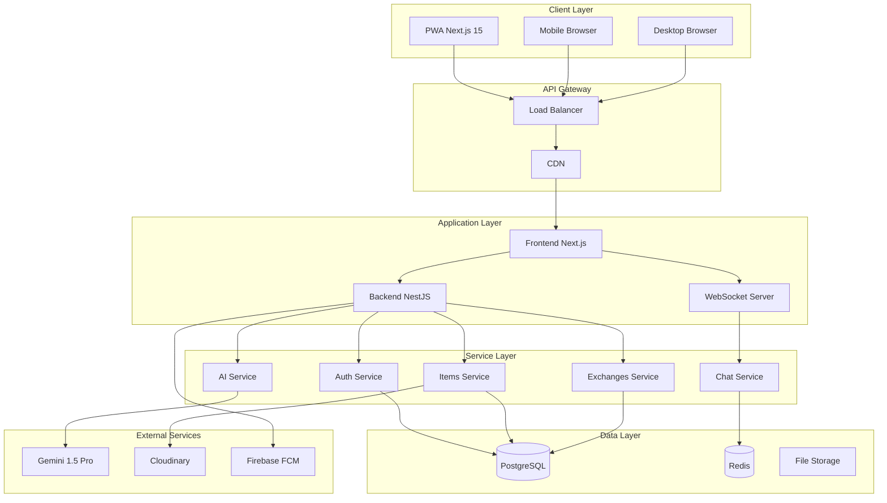
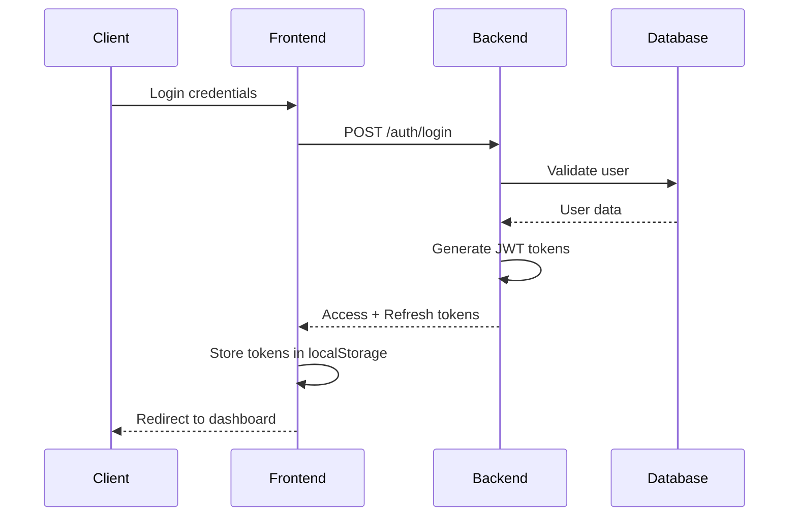
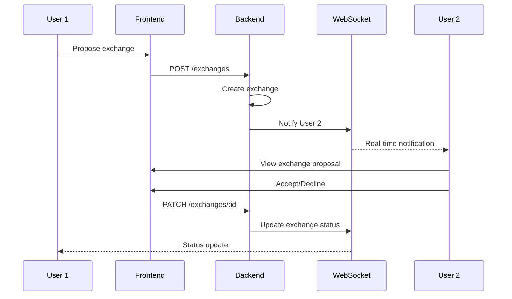
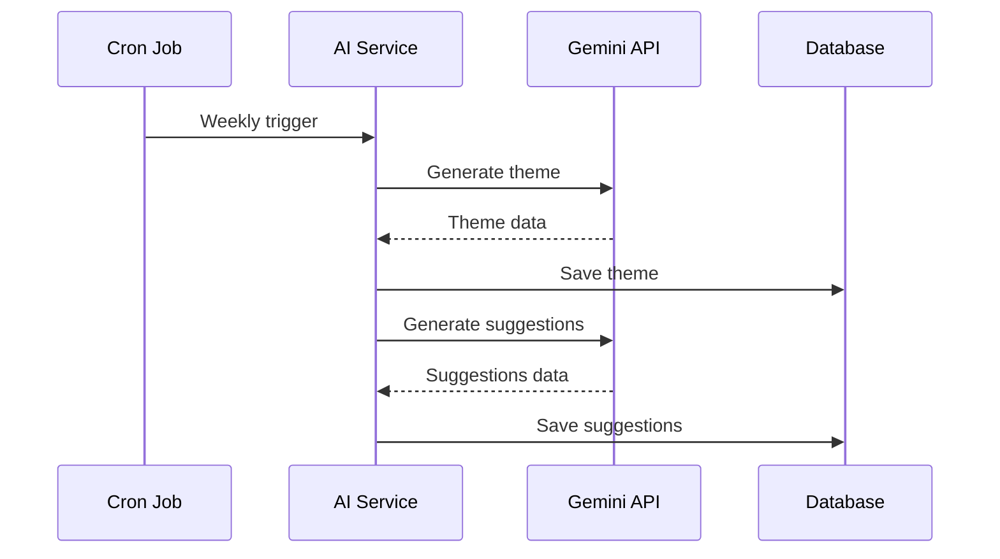
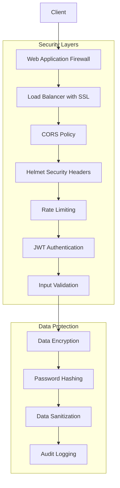

# Architecture SecondLife Exchange

## Vue d'ensemble

SecondLife Exchange suit une architecture moderne de type **monorepo** avec séparation claire entre le frontend et le backend, utilisant des technologies de pointe pour assurer performance, sécurité et maintenabilité.

## Architecture générale



## Stack technique détaillée

### Frontend (Next.js 15 PWA)

**Architecture** : App Router avec Server Components et Client Components

```
src/
├── app/                    # App Router (Next.js 15)
│   ├── layout.tsx         # Layout racine
│   ├── page.tsx           # Page d'accueil
│   ├── login/             # Pages d'authentification
│   ├── register/
│   ├── explore/           # Exploration des objets
│   ├── item/[id]/         # Détails d'un objet
│   ├── profile/           # Profil utilisateur
│   └── chat/[exchangeId]/ # Chat temps réel
├── components/            # Composants réutilisables
│   ├── ui/               # Composants UI de base (shadcn/ui)
│   ├── forms/            # Formulaires
│   ├── layout/           # Composants de layout
│   └── features/         # Composants métier
├── lib/                  # Utilitaires et configuration
│   ├── api.ts           # Client API avec intercepteurs
│   ├── utils.ts         # Fonctions utilitaires
│   └── validations.ts   # Schémas de validation Zod
├── store/               # État global (Zustand)
│   ├── auth.ts         # Store d'authentification
│   ├── theme.ts        # Store de thème
│   └── items.ts        # Store des objets
└── types/              # Types TypeScript
    └── index.ts        # Types partagés
```

**Technologies clés** :
- **Next.js 15** : Framework React avec App Router
- **Tailwind CSS** : Framework CSS utility-first
- **shadcn/ui** : Composants UI accessibles et personnalisables
- **Framer Motion** : Animations et transitions fluides
- **Zustand** : Gestion d'état légère et performante
- **React Hook Form** + **Zod** : Formulaires avec validation
- **Socket.io Client** : Communication temps réel
- **next-pwa** : Fonctionnalités PWA (offline, installable)

### Backend (NestJS)

**Architecture** : Modular avec séparation des responsabilités

```
src/
├── main.ts              # Point d'entrée de l'application
├── app.module.ts        # Module racine
├── common/              # Utilitaires partagés
│   ├── prisma/         # Service Prisma
│   ├── dto/            # DTOs partagés
│   ├── guards/         # Guards d'authentification
│   ├── interceptors/   # Intercepteurs globaux
│   └── decorators/     # Décorateurs personnalisés
└── modules/            # Modules métier
    ├── health/         # Health check
    ├── auth/           # Authentification JWT
    ├── users/          # Gestion utilisateurs
    ├── items/          # CRUD objets
    ├── exchanges/      # Gestion échanges
    ├── chat/           # WebSocket chat
    └── ai/             # Intégration Gemini
```

**Technologies clés** :
- **NestJS** : Framework Node.js avec architecture modulaire
- **Prisma** : ORM moderne avec type-safety
- **PostgreSQL** : Base de données relationnelle
- **Redis** : Cache et sessions
- **JWT** : Authentification stateless
- **Socket.io** : WebSockets pour le chat temps réel
- **Helmet** + **CORS** + **Rate Limiting** : Sécurité
- **Class Validator** + **Zod** : Validation des données
- **Cron Jobs** : Tâches programmées pour l'IA

## Flux de données

### Authentification



### Création d'un échange



### Génération de suggestions IA



## Base de données

### Schéma Prisma

```prisma
model User {
  id        String   @id @default(cuid())
  email     String   @unique
  username  String   @unique
  password  String
  firstName String?
  lastName  String?
  avatar    String?
  bio       String?
  location  String?
  phone     String?
  isActive  Boolean  @default(true)
  createdAt DateTime @default(now())
  updatedAt DateTime @updatedAt

  itemsOwned     Item[]
  exchangesInitiated Exchange[] @relation("ExchangeInitiator")
  exchangesReceived Exchange[] @relation("ExchangeReceiver")
  messages       Message[]
  refreshTokens  RefreshToken[]
}

model Item {
  id          String   @id @default(cuid())
  title       String
  description String
  category    String
  condition   String
  images      String[]
  tags        String[]
  isAvailable Boolean  @default(true)
  ownerId     String
  createdAt   DateTime @default(now())
  updatedAt   DateTime @updatedAt

  owner    User       @relation(fields: [ownerId], references: [id])
  exchanges Exchange[]
}

model Exchange {
  id          String      @id @default(cuid())
  status      ExchangeStatus @default(PENDING)
  initiatorId String
  receiverId  String
  itemId      String
  message     String?
  createdAt   DateTime    @default(now())
  updatedAt   DateTime    @updatedAt
  completedAt DateTime?

  initiator User      @relation("ExchangeInitiator", fields: [initiatorId], references: [id])
  receiver  User      @relation("ExchangeReceiver", fields: [receiverId], references: [id])
  item      Item      @relation(fields: [itemId], references: [id])
  messages  Message[]
}

model WeeklyTheme {
  id          String   @id @default(cuid())
  title       String
  description String
  weekNumber  Int
  year        Int
  isActive    Boolean  @default(false)
  createdAt   DateTime @default(now())
  updatedAt   DateTime @updatedAt

  suggestedItems SuggestedItem[]
}

model SuggestedItem {
  id           String   @id @default(cuid())
  title        String
  description  String
  category     String
  reason       String
  themeId      String
  createdAt    DateTime @default(now())

  theme WeeklyTheme @relation(fields: [themeId], references: [id])
}
```

## Sécurité

### Architecture de sécurité



### Mesures de sécurité implémentées

1. **Authentification** :
   - JWT avec tokens d'accès courts (15min)
   - Refresh tokens avec rotation
   - Hashage bcrypt des mots de passe

2. **Autorisation** :
   - Guards NestJS pour la protection des routes
   - Vérification des permissions par ressource
   - Isolation des données utilisateur

3. **Validation** :
   - Validation stricte avec Zod et Class Validator
   - Sanitisation des entrées utilisateur
   - Protection contre l'injection SQL (Prisma)

4. **Protection réseau** :
   - CORS configuré strictement
   - Headers de sécurité avec Helmet
   - Rate limiting par IP et utilisateur

## Performance

### Optimisations frontend

- **Code Splitting** : Chargement à la demande des composants
- **Image Optimization** : Next.js Image avec lazy loading
- **Caching** : Service Worker avec stratégies de cache
- **Bundle Analysis** : Optimisation de la taille des bundles
- **Tree Shaking** : Élimination du code mort

### Optimisations backend

- **Database Indexing** : Index optimisés pour les requêtes fréquentes
- **Query Optimization** : Requêtes Prisma optimisées
- **Caching** : Redis pour le cache des sessions et données
- **Connection Pooling** : Pool de connexions PostgreSQL
- **Compression** : Gzip/Brotli pour les réponses API

## Monitoring et observabilité

### Métriques collectées

- **Performance** : Temps de réponse API, Core Web Vitals
- **Erreurs** : Taux d'erreur, stack traces
- **Utilisation** : Nombre d'utilisateurs actifs, requêtes
- **Business** : Nombre d'échanges, objets créés

### Outils de monitoring

- **Application** : Logs structurés avec Winston
- **Infrastructure** : Health checks et métriques système
- **Errors** : Tracking des erreurs avec stack traces
- **Analytics** : Métriques d'usage et performance

## Scalabilité

### Architecture horizontale

- **Load Balancing** : Distribution de charge sur plusieurs instances
- **Database Sharding** : Partitionnement des données par région
- **CDN** : Distribution globale du contenu statique
- **Microservices** : Séparation des services pour l'échelle

### Optimisations futures

- **Caching distribué** : Redis Cluster pour le cache
- **Database replication** : Réplication en lecture
- **Message queues** : Traitement asynchrone des tâches
- **Container orchestration** : Kubernetes pour la gestion des conteneurs

## Déploiement

### Environnements

- **Development** : Docker Compose local
- **Staging** : Environnement de test automatisé
- **Production** : Déploiement avec CI/CD

### Pipeline CI/CD

1. **Code Quality** : ESLint, Prettier, TypeScript
2. **Testing** : Tests unitaires et e2e
3. **Security** : Audit des dépendances
4. **Build** : Compilation et optimisation
5. **Deploy** : Déploiement automatisé
6. **Monitor** : Surveillance post-déploiement

Cette architecture garantit une application robuste, sécurisée et évolutive, prête pour la production et l'échelle.
