# Diagrammes de communication - SecondLife Exchange

## Vue d'ensemble

Ce document présente les diagrammes de communication pour la plateforme SecondLife Exchange, décrivant les interactions entre les différents composants du système et les protocoles de communication utilisés.

## 1. Architecture de communication globale

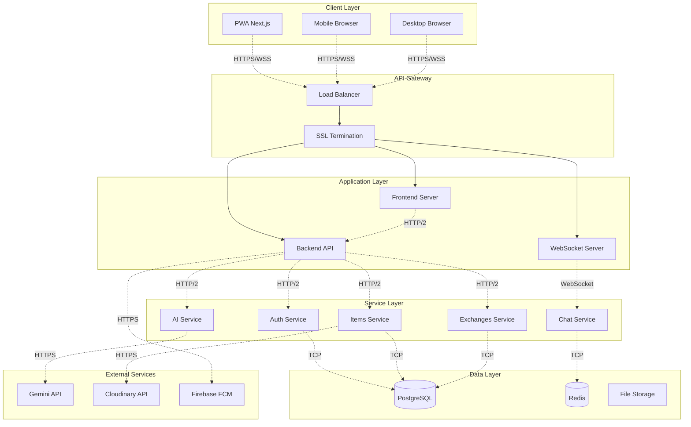

## 2. Protocoles de communication

### Frontend ↔ Backend

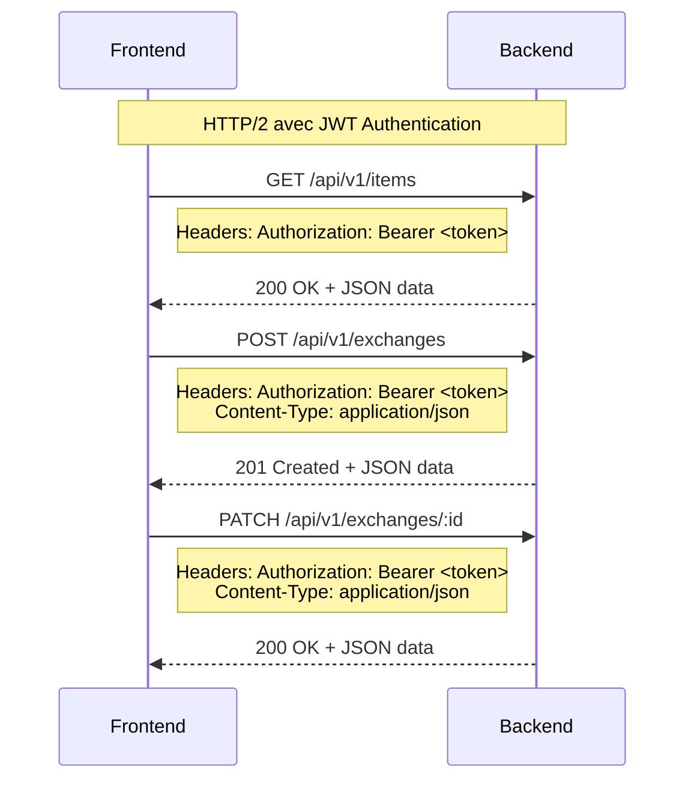

### WebSocket Communication

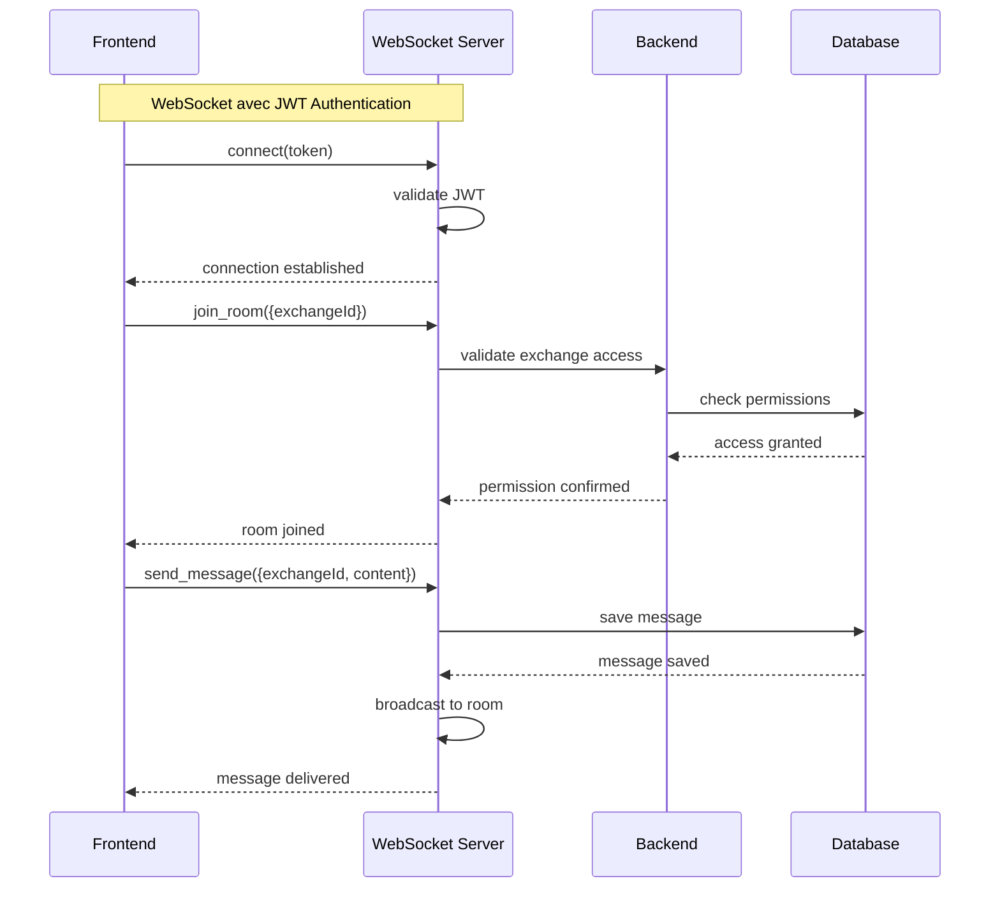

## 3. Communication avec les services externes

### Intégration Gemini AI

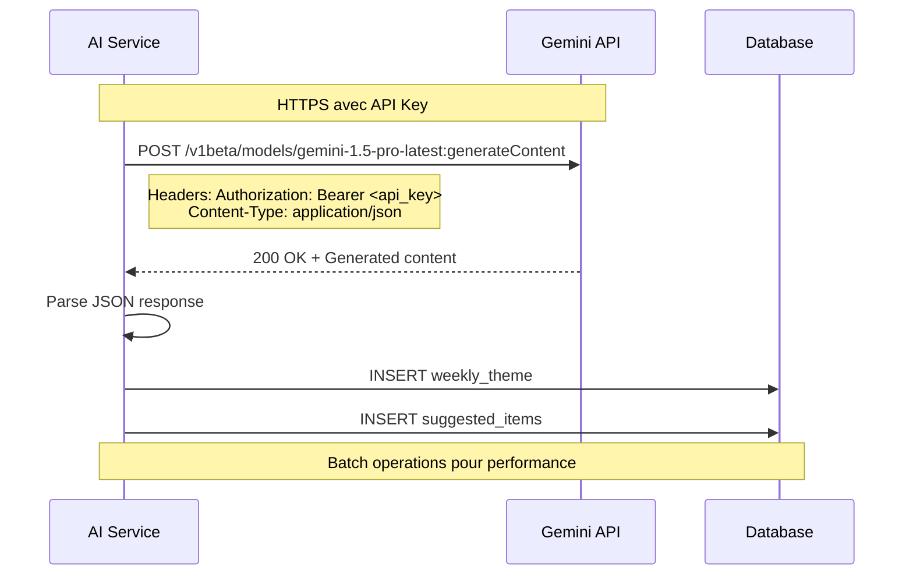

### Intégration Cloudinary

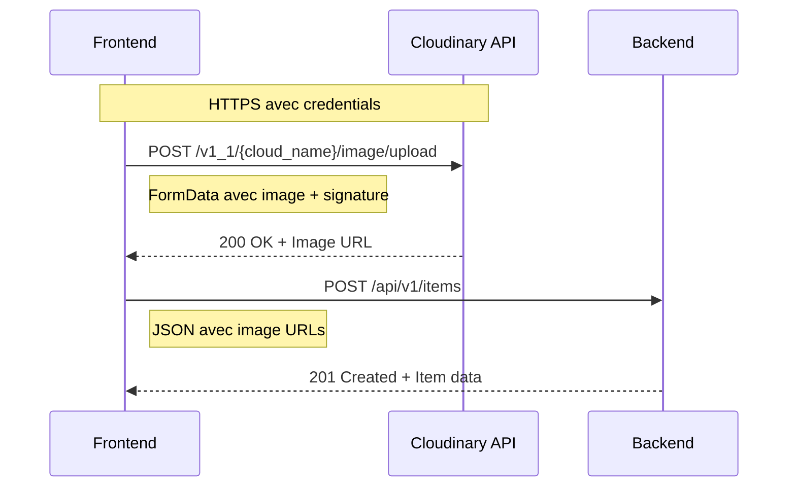

## 4. Communication inter-services

### Service d'authentification

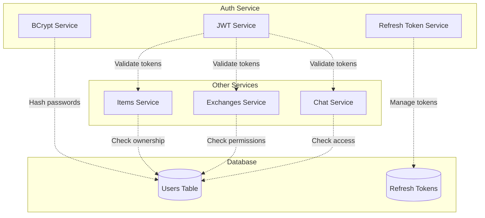

### Service de chat temps réel

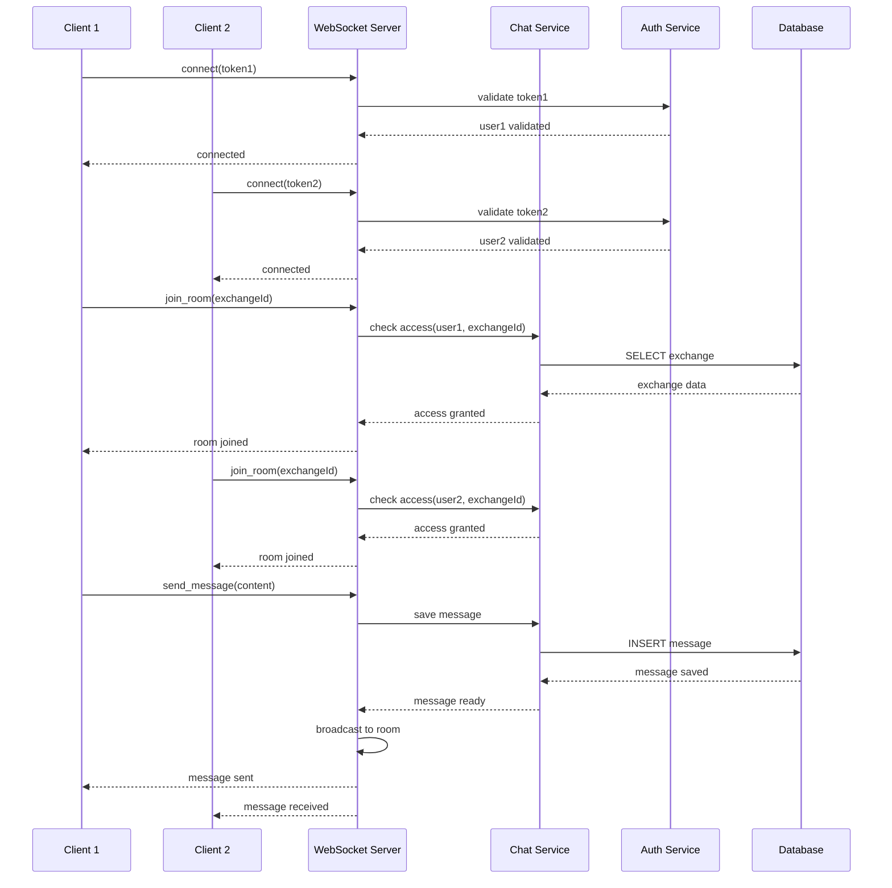

## 5. Patterns de communication

### Request-Response Pattern

```mermaid
graph LR
    Client[Client] -->|Request| Server[Server]
    Server -->|Response| Client
    
    Note over Client,Server: HTTP REST API<br/>Synchronous communication
```

### Publish-Subscribe Pattern

```mermaid
graph TB
    Publisher[Publisher] -->|Publish| Broker[Message Broker]
    Broker -->|Subscribe| Subscriber1[Subscriber 1]
    Broker -->|Subscribe| Subscriber2[Subscriber 2]
    Broker -->|Subscribe| Subscriber3[Subscriber 3]
    
    Note over Publisher,Subscriber3: WebSocket rooms<br/>Real-time notifications
```

### Event-Driven Pattern

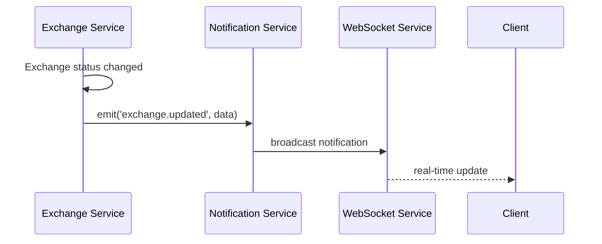

## 6. Gestion des erreurs et retry

### Circuit Breaker Pattern

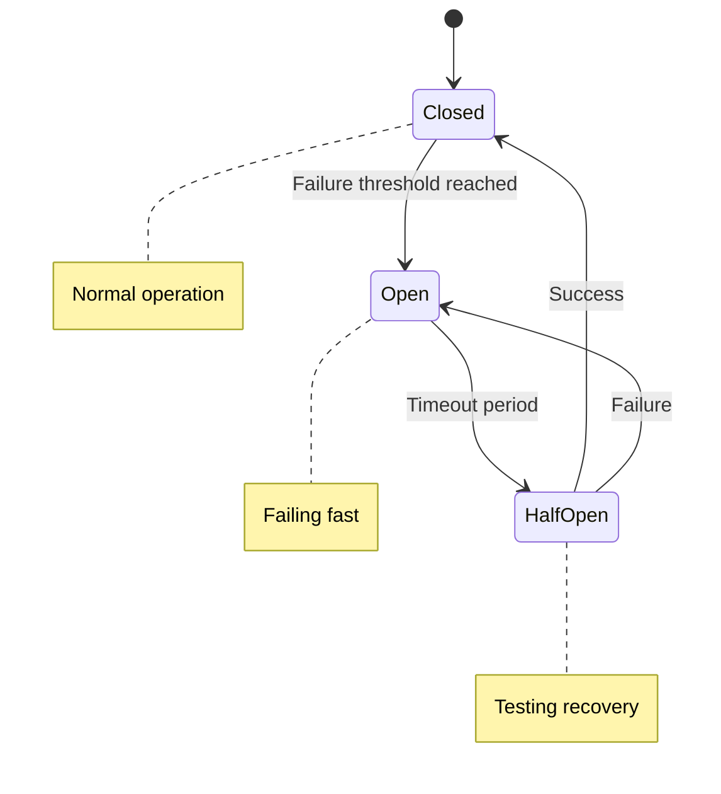

### Retry avec backoff exponentiel

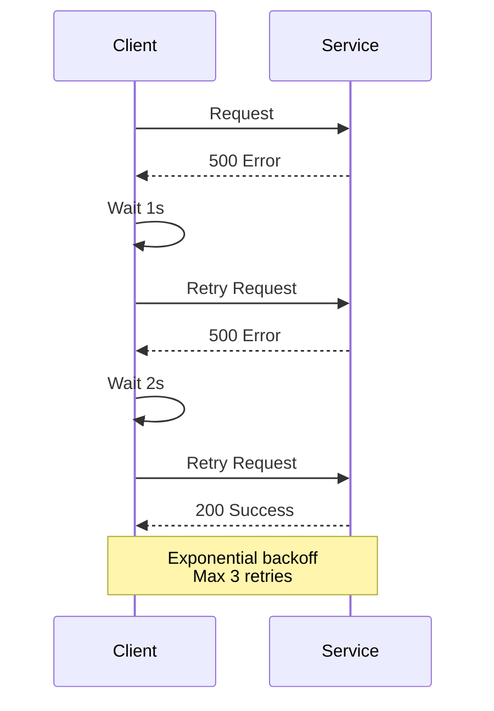

## 7. Monitoring et observabilité

### Logging structuré

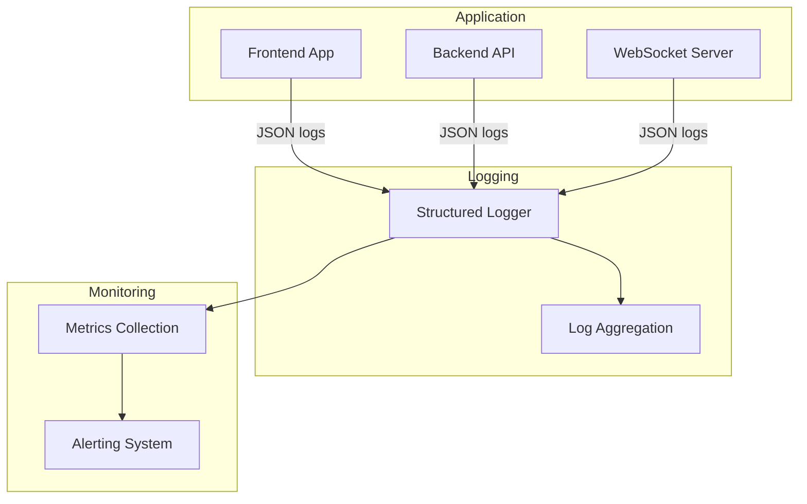

### Health checks

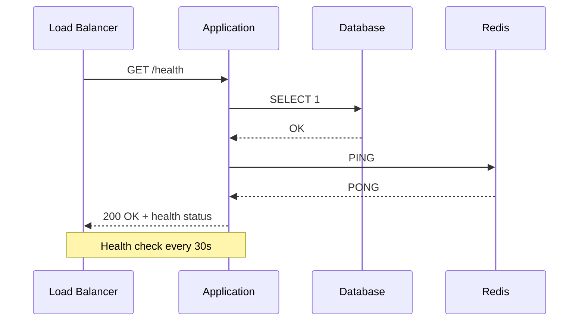

## 8. Sécurité des communications

### Chiffrement en transit

```mermaid
graph TB
    Client[Client] -->|HTTPS/TLS 1.3| LB[Load Balancer]
    LB -->|HTTP/2| App[Application]
    App -->|TLS| DB[Database]
    App -->|TLS| Cache[Redis]
    App -->|HTTPS| External[External APIs]
    
    Note over Client,External : End-to-end encryption<br/>Perfect Forward Secrecy
```

### Validation des tokens JWT

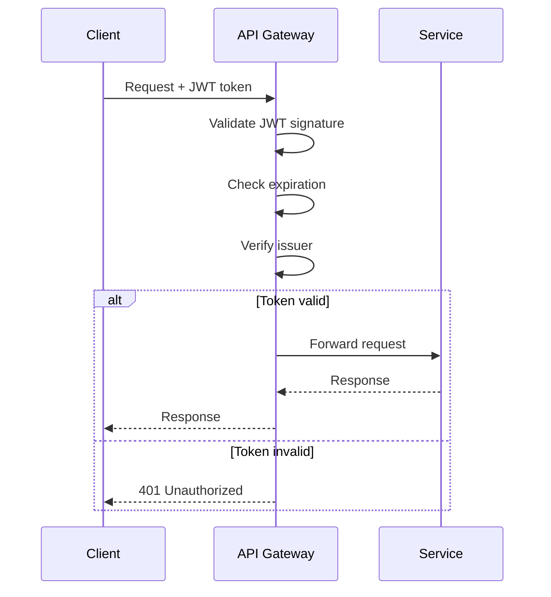

Ces diagrammes de communication décrivent l'architecture de communication complète de SecondLife Exchange, garantissant une communication sécurisée, performante et fiable entre tous les composants du système.
