# Diagrammes de séquence - SecondLife Exchange

## Vue d'ensemble

Ce document présente les diagrammes de séquence pour les interactions principales de la plateforme SecondLife Exchange, décrivant le flux temporel des messages entre les différents composants du système.

## 1. Authentification utilisateur

### Connexion

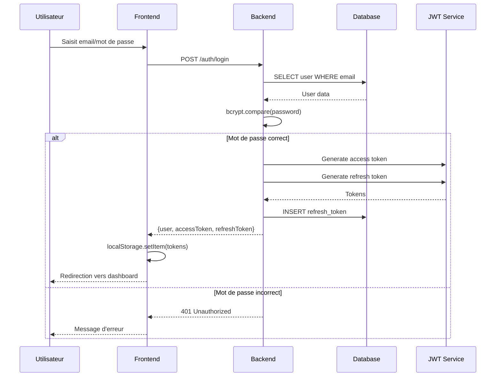

### Inscription

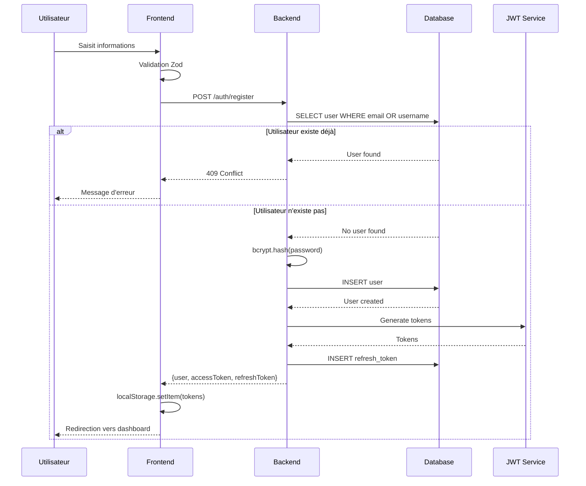

## 2. Gestion des objets

### Publication d'un objet

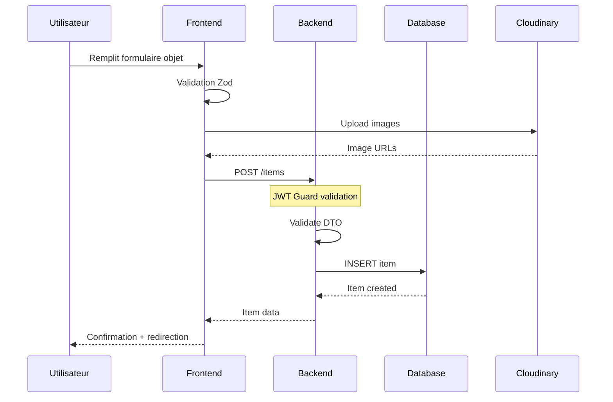

### Recherche d'objets

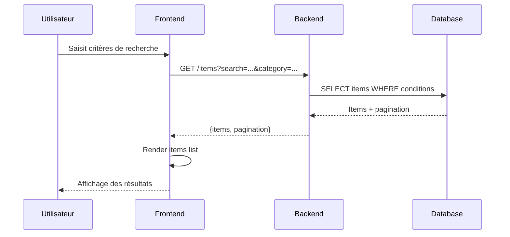

## 3. Gestion des échanges

### Proposition d'échange

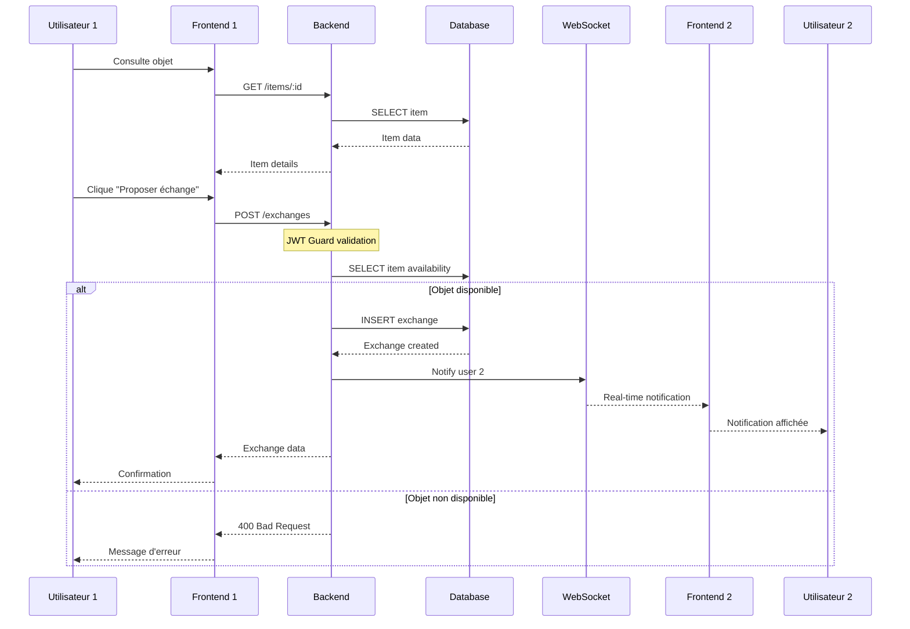

### Acceptation d'échange

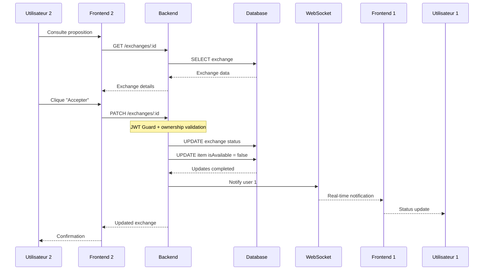

## 4. Chat temps réel

### Envoi de message

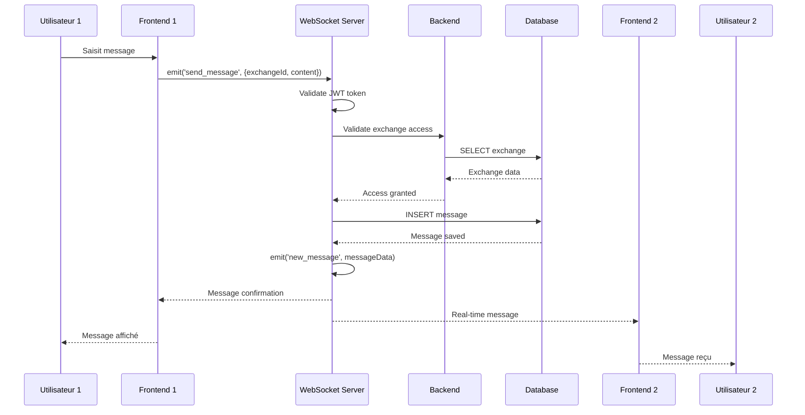

### Connexion au chat

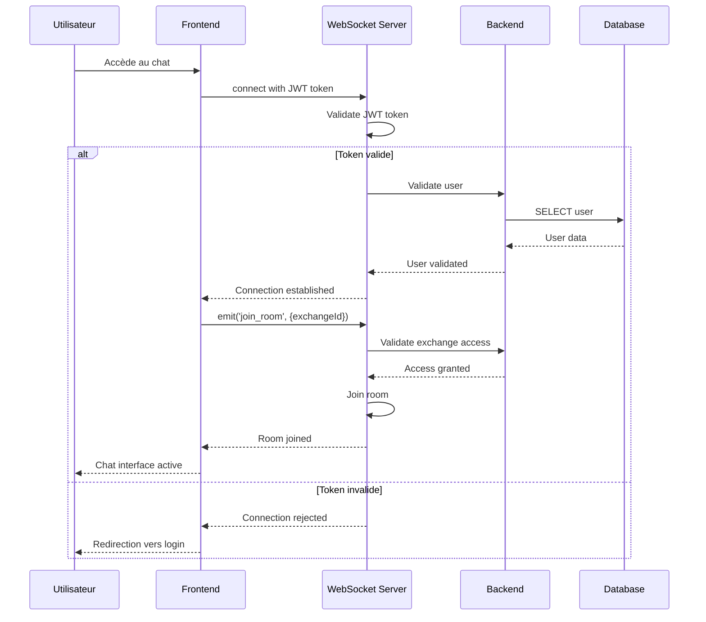

## 5. Suggestions IA

### Génération hebdomadaire automatique

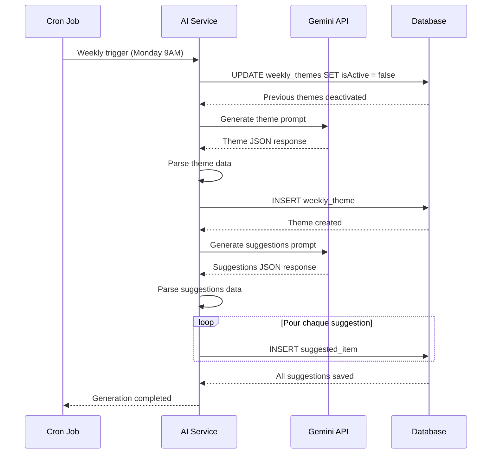

### Consultation du thème actuel

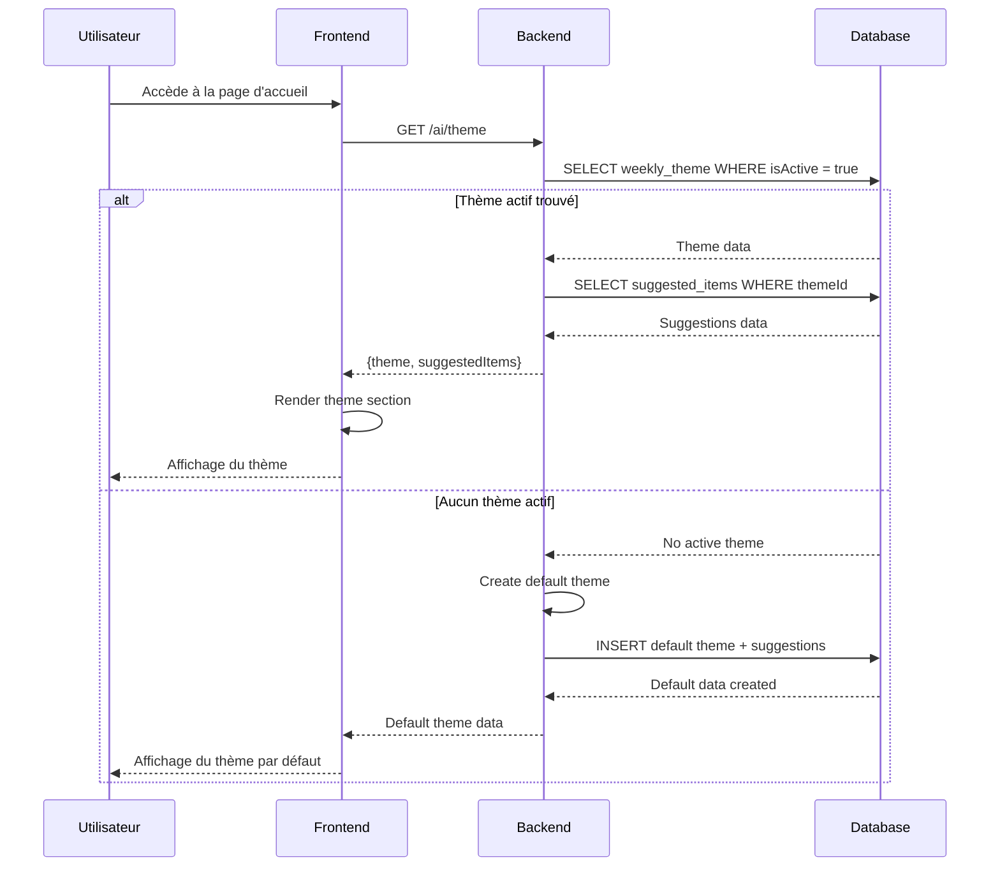

## 6. Gestion des erreurs

### Gestion des erreurs réseau

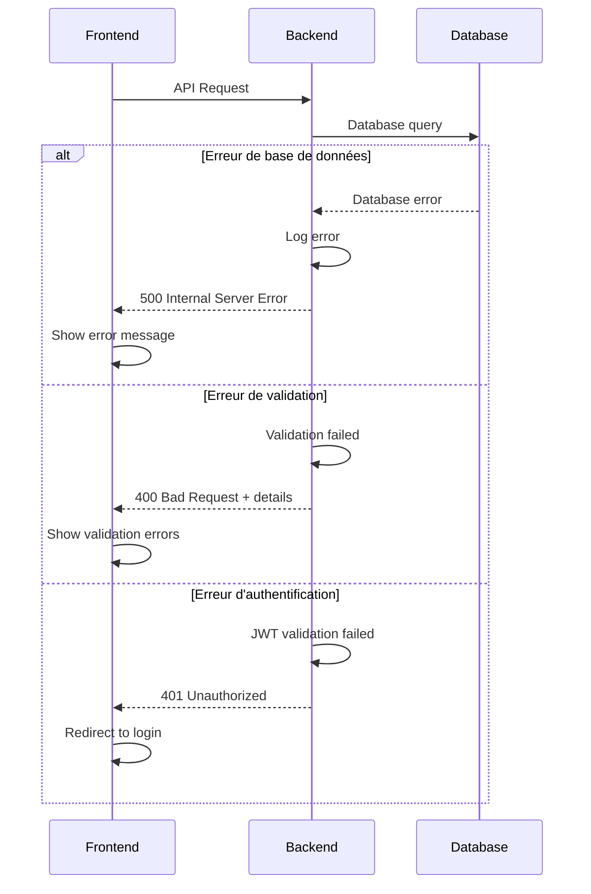

### Refresh token automatique

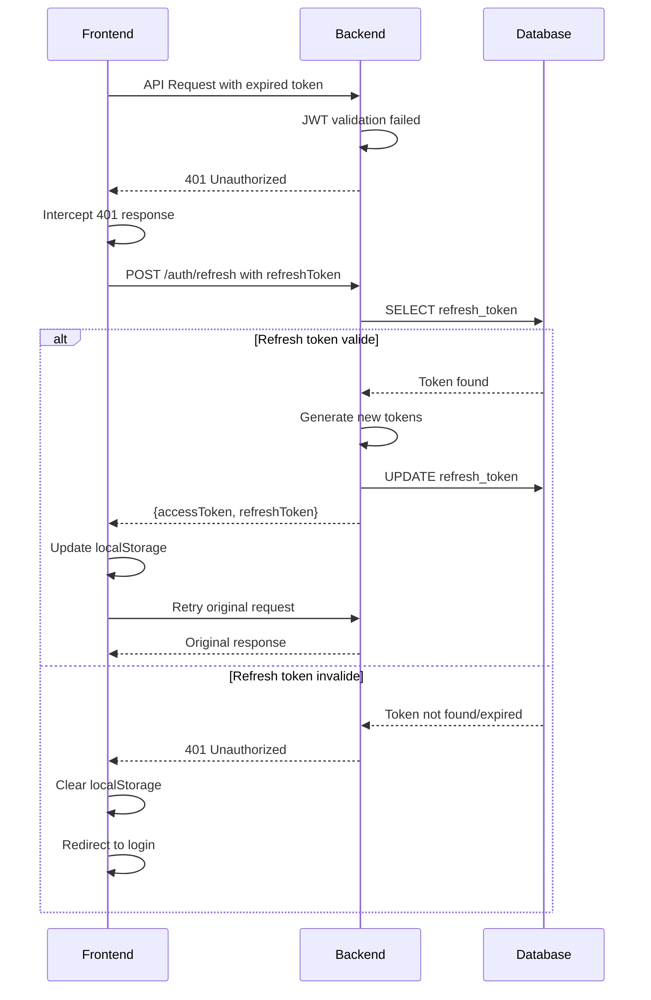

Ces diagrammes de séquence décrivent le comportement détaillé du système SecondLife Exchange et servent de référence pour l'implémentation et les tests.
