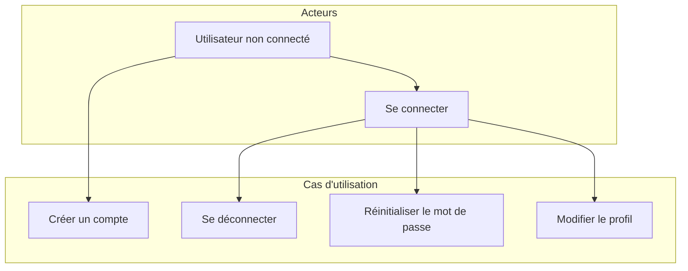
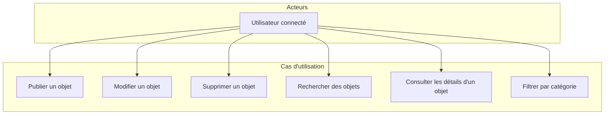
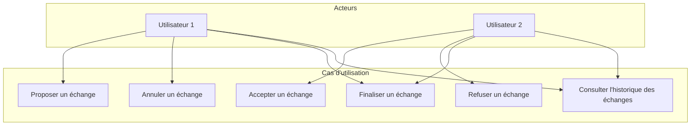
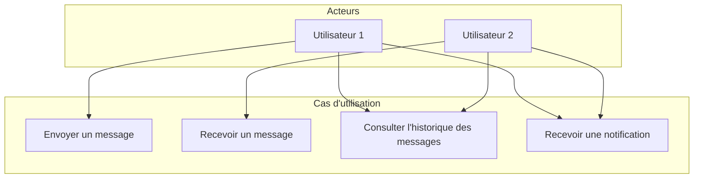
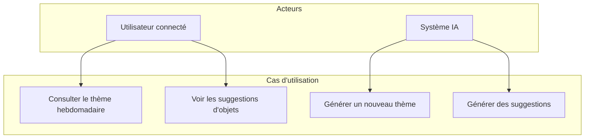

# Diagrammes de cas d'utilisation - SecondLife Exchange

## Vue d'ensemble

Ce document présente les diagrammes de cas d'utilisation pour la plateforme SecondLife Exchange, décrivant les interactions entre les acteurs et le système.

## Acteurs principaux

- **Utilisateur non connecté** : Visiteur du site
- **Utilisateur connecté** : Membre de la plateforme
- **Administrateur** : Gestionnaire de la plateforme
- **Système IA** : Service de génération de suggestions

## Cas d'utilisation principaux

### 1. Gestion de l'authentification

### 2. Gestion des objets

### 3. Gestion des échanges

### 4. Communication temps réel

### 5. Suggestions IA

## Diagramme de cas d'utilisation global

```mermaid
graph TB
    subgraph "Acteurs externes"
        UC[Utilisateur non connecté]
        U[Utilisateur connecté]
        A[Administrateur]
        AI[Système IA]
    end
    
    subgraph "Système SecondLife Exchange"
        subgraph "Authentification"
            UC1[Créer un compte]
            UC2[Se connecter]
            UC3[Se déconnecter]
        end
        
        subgraph "Gestion des objets"
            UC4[Publier un objet]
            UC5[Rechercher des objets]
            UC6[Consulter un objet]
        end
        
        subgraph "Gestion des échanges"
            UC7[Proposer un échange]
            UC8[Accepter/Refuser un échange]
            UC9[Finaliser un échange]
        end
        
        subgraph "Communication"
            UC10[Chat temps réel]
            UC11[Notifications]
        end
        
        subgraph "Suggestions IA"
            UC12[Thème hebdomadaire]
            UC13[Suggestions d'objets]
        end
    end
    
    UC --> UC1
    UC --> UC2
    U --> UC3
    U --> UC4
    U --> UC5
    U --> UC6
    U --> UC7
    U --> UC8
    U --> UC9
    U --> UC10
    U --> UC11
    U --> UC12
    U --> UC13
    AI --> UC12
    AI --> UC13
```

## Spécifications détaillées

### UC-001 : Créer un compte

**Acteur principal** : Utilisateur non connecté

**Préconditions** : Aucune

**Scénario principal** :
1. L'utilisateur accède à la page d'inscription
2. L'utilisateur saisit ses informations (email, nom d'utilisateur, mot de passe)
3. Le système valide les données
4. Le système crée le compte
5. Le système envoie un email de confirmation
6. L'utilisateur est automatiquement connecté

**Scénarios alternatifs** :
- 3a. Données invalides : Le système affiche les erreurs
- 4a. Email déjà utilisé : Le système affiche une erreur

### UC-002 : Proposer un échange

**Acteur principal** : Utilisateur connecté

**Préconditions** : L'utilisateur est connecté et consulte un objet disponible

**Scénario principal** :
1. L'utilisateur consulte les détails d'un objet
2. L'utilisateur clique sur "Proposer un échange"
3. L'utilisateur saisit un message optionnel
4. Le système crée la proposition d'échange
5. Le propriétaire de l'objet reçoit une notification
6. Un chat est créé pour la négociation

**Scénarios alternatifs** :
- 1a. Objet non disponible : Le système affiche un message d'erreur
- 4a. Échange déjà en cours : Le système affiche un message d'erreur

### UC-003 : Chat temps réel

**Acteur principal** : Utilisateur connecté

**Préconditions** : Un échange est en cours entre deux utilisateurs

**Scénario principal** :
1. L'utilisateur accède au chat de l'échange
2. L'utilisateur saisit un message
3. Le système envoie le message en temps réel
4. L'autre utilisateur reçoit le message instantanément
5. L'historique des messages est sauvegardé

**Scénarios alternatifs** :
- 2a. Message vide : Le système ignore l'envoi
- 3a. Connexion perdue : Le système tente de reconnecter

## Métriques et KPIs

### Métriques d'usage
- Nombre d'inscriptions par jour
- Taux de conversion visiteur → utilisateur
- Nombre d'objets publiés par utilisateur
- Taux d'acceptation des échanges

### Métriques de performance
- Temps de réponse des pages
- Taux d'erreur des API
- Temps de chargement des images
- Score Lighthouse PWA

### Métriques business
- Nombre d'échanges finalisés
- Taux de satisfaction utilisateur
- Engagement avec les suggestions IA
- Rétention des utilisateurs

Ces diagrammes de cas d'utilisation servent de base pour le développement et les tests de la plateforme SecondLife Exchange.
